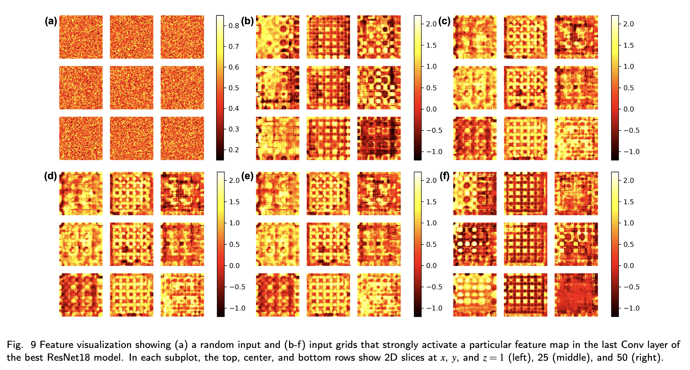

## Selected projects

---

### Spinodal decomposition via Cahn-Hilliard equation

Simple Python script for solving the Cahn-Hilliard equation using the Forward Euler method.

  
  

### ZeoNet

Using convolutional neural networks on volumetric data to predict adsorption properties in nanoporous materials. Published in Journal of Materials Chemisty A <a href="https://pubs.rsc.org/en/content/articlelanding/2023/ta/d3ta01911j">[Ref]</a>. Contributed to the early stages of this project.

  

